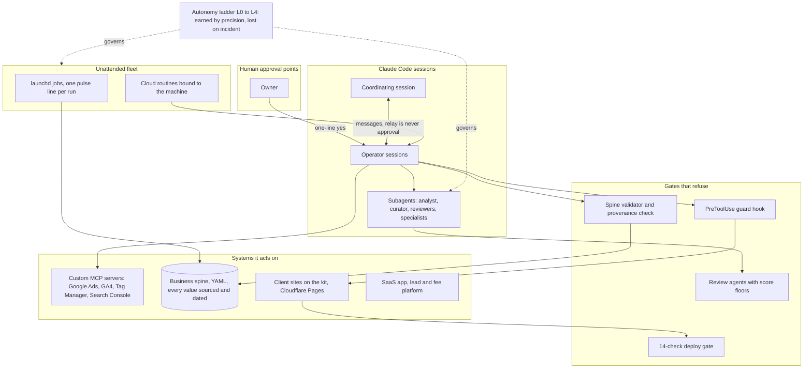

# An agency running on Claude Code as its operating system

A working digital agency, run day to day on Claude Code. Twenty-five years of software engineering
underneath it; Claude Code is the newest thing it runs on. This page describes the system. The source is
private because it is the agency's own infrastructure; read-only access to specific repositories is
available on request.

## This is not a demo stack

It runs live client work. Sixteen repositories: client sites on a shared Eleventy kit with a fourteen-check
deploy gate, one of them selling through Stripe; a SaaS product in production; a lead
pipeline and performance-fee platform a client runs his business on; a Google Ads MCP server forked onto the
official client; and the agency's own site.

## How it fits together

## The parts worth five minutes

**The autonomy ladder.** Every automation carries a trust level from L0 (propose only, a human approves
every action) to L4. The levels are recorded as facts about granted trust, not aspirations. An automation
moves up one level at a time through a graduation case with a track record behind it, and drops on any
harmful error, silent failure, or human correction. Twenty-three automations sit on the register today,
most at L0 and L1.

**The guard hook.** A Claude Code PreToolUse hook that refuses three things: pushing a design change that
has no recorded critique for that exact commit, taking a site out of prelaunch before the launch has been
signed off, and deploying by direct upload instead of through the build. The agent cannot skip a review it
did not do, and it cannot grant itself an exception.

## The rest of the system

- **Skills and agents.** Thirty skills selected by trigger description; eight subagents. Outcome skills run
  other skills and agents as a team, in parallel where the work allows, with gates between steps.
- **The business spine.** One YAML record of leads, projects, accounts, products and opportunities, every
  value carrying a source and a date, unknowns written as unknown. Writes are propose-only; a validator
  refuses bad patches all-or-nothing; a provenance check fails the build if any money figure lacks an
  event or an estimate label. Four registers and the operating page are generated views, never hand-edited.
- **The learning loop.** One agent flags analytics signals; a second grades them against real outcomes,
  with precision and recall per signal, scores its own confidence, and promotes a pattern only
  after repeated confirmation against real outcomes. That is the design; the record behind it is still young.
- **The site kit.** An Eleventy and Cloudflare Pages chassis. A fourteen-check verify script, each check
  tied to a real incident, is the Cloudflare build command, so a failing check cannot deploy. A lesson paid for on any site is fixed in the kit first.
- **Custom MCP servers.** Google Ads (forked onto the official Python client), GA4 reporting, Tag Manager
  with a governed create, version and publish protocol, and Search Console including URL Inspection.
- **The unattended fleet.** launchd jobs that each write one line per run to a pulse log, so silence
  shows as stale and never as green; a nightly backup gated by gitleaks; cloud routines bound to the
  machine. One job runs headless behind a verification gate.
- **Multi-session orchestration.** A coordinating session and dedicated operator sessions that message
  each other, with a reviewer distinct from the approver and a rule that a relayed word is never an
  approval.

## Where Claude Code broke, and what I did about it

Running this daily surfaced edges that do not show up in demos:

- Headless runs see connector tools under friendly-name prefixes while desktop permission rules use UUID
  prefixes, so every connector call was denied when unattended.
- Cloud routines keep a snapshot of their prompt at creation; later edits to the source file never reach
  them.
- Skills do not inherit past a nested git repository boundary.
- A stale CLI read a multi-line `description: |` field as the literal string `|`.

Each has a workaround in the workspace. Happy to walk through any of them.

## Not here

Source code, client data, credentials, client names. The one published case study is on the agency site;
the rest of the agency's history is available as a walkthrough rather than a claim.
