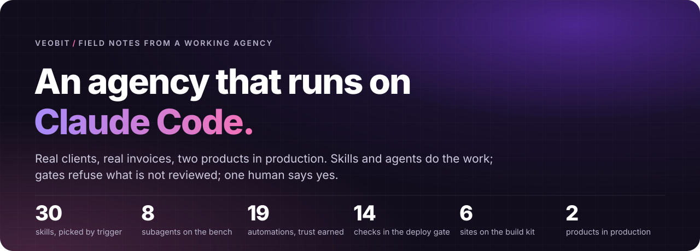
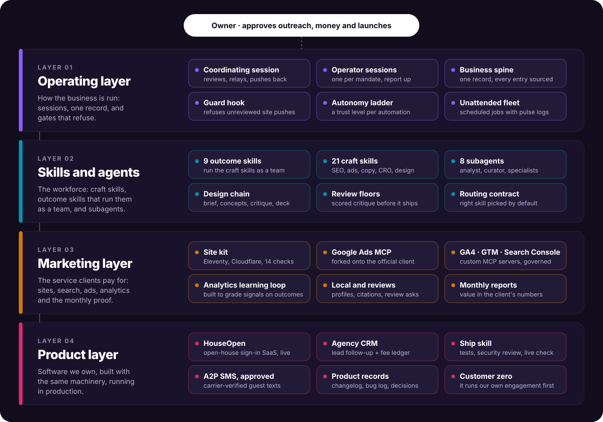
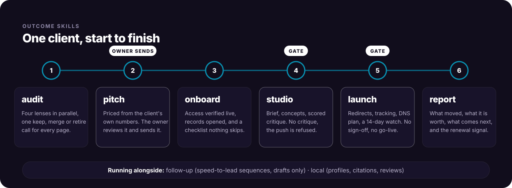
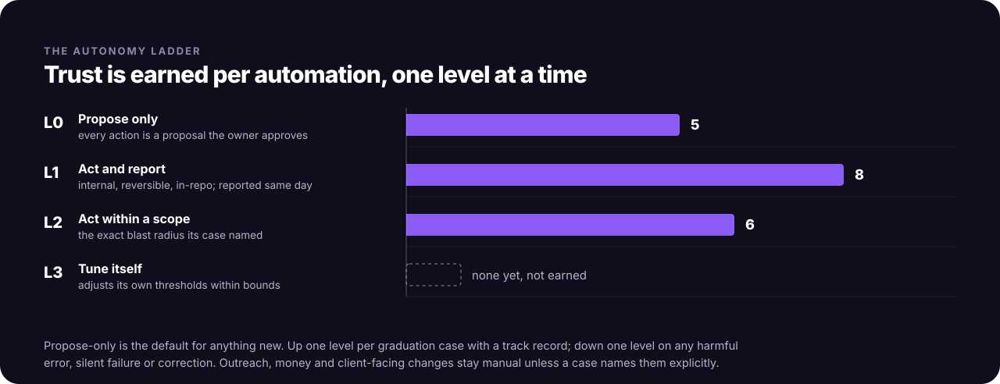

  

Veobit is a small digital agency in New Jersey. We build websites and run search, ads and analytics for local
service businesses. Clients pay on retainer, by the hour, by the project, and in one case on performance.

The whole agency runs through Claude Code. It is not a coding assistant on the side. Claude Code sessions do the
client work and keep the business record. They ship two products of our own. And they answer to gates they cannot
argue their way past.

I have been writing software for 25 years, and I co-founded and exited a B2B SaaS company. This page is the
write-up of what it takes to run a real business this way: what works, where it broke, and what I built so it
would not break the same way twice. The source stays private because it is the agency's own infrastructure.
Walkthroughs are available on request.

  

---

## Marketing layer: the work clients pay for

A new lead does not start with a blank chat. It enters a chain of **outcome skills**. Each one runs the craft
skills and agents it needs as a team, in parallel where the work allows, and stops at a gate before the next
step.

  

- **The site kit.** New client sites are built on one chassis, Eleventy on Cloudflare Pages. The Cloudflare build
  command is a 14-check verify script, so a site that fails a check cannot deploy. Each check exists because
  something went wrong on a real site. A lesson learned on any one site goes into the kit first, so every site
  gets it. Six sites are live or in build on it.
- **Paid search.** A Google Ads MCP server forked onto Google's official client library. Ad changes follow a
  written change protocol. The daily search-term check only proposes changes, and it stays that way by design.
- **Analytics that learn.** Custom MCP servers for GA4, Tag Manager and Search Console. Tag Manager changes follow
  a controlled create, version and publish routine, and Search Console access includes URL inspection. An analyst
  agent flags signals. A curator agent grades each signal against what actually happened, keeps a precision score
  for it, and promotes a pattern only after it has held up repeatedly. That is the design; the track record is
  still young.
- **Proof, monthly.** The report skill turns the month into a client-ready deck of what was done, what it moved
  and what that is worth, measured in the client's own numbers. Alongside the deck it produces the invoice line
  and a renewal or risk note for me.

## Product layer: software we own

The same machinery ships products. Every product change goes through one **ship** skill:
- a branch, then tests;
- a security review whenever login, data or personal information is touched;
- every place the product deploys to;
- a live check both signed in and signed out;
- the product's records updated in the same commit.

Every bug gets an ID, a root cause and a check in production after the fix.

**HouseOpen** is an open-house sign-in app for real estate agents. A guest scans a QR code at the door and
registers. The guest gets a confirmation, plus a text if they opt in, and the agent gets the lead in real time.

Getting the text messages approved by the carriers took six submissions, and each rejection taught something:
- The carriers' vetting crawler does not run JavaScript, so a single-page app looked empty to it. The fix was a
  page shell the crawler can read, plus a static page showing the opt-in exactly as guests see it.
- Then a human reviewer required a consent checkbox that starts unchecked and is separate from registering. That
  is now the live design.

Where it stands: one brokerage on a free founder plan, four real open houses and twelve registrations. Next on
the roadmap: stabilizing and an operator view, then self-serve signup, then billing.

**The agency CRM** is a lead follow-up and payout app built for a performance engagement. Every lead, every touch,
every estimate and the fee that follows live in one record that both sides can see. The leads the client submits
are the record; the storage behind them can be swapped. It runs daily for one client. The plan is to turn it into
a product for agencies that are paid on performance, with Veobit as customer zero. That plan is paused while the
first instance runs.

## Skills and agents: the workforce

**30 skills**, registered with Claude Code so that each session picks them by what the task needs, not only when
someone names them.

- **21 craft skills** cover:
  - search: technical SEO, schema;
  - ads and analytics: Google Ads, analytics tracking, analytics intelligence;
  - writing: copywriting, copy editing, conversion critique, page CRO;
  - planning and pitching: content strategy, social, competitor profiling, client discovery, proposals, review
    guides;
  - design and brand: creative concepts, design briefs, design decks, UI/UX critique, logo, brand.
- **9 outcome skills** run the craft skills as a team: audit, pitch, onboard, studio, launch, report, local and
  follow-up for client work, and ship for the products.

**8 subagents:** the analytics analyst and curator (the learning loop), a content strategist, a copywriter, PPC,
SEO and presentation specialists, and an operating-partner agent for the business review.

A routing contract makes every deliverable name the skill it ran under. When something goes wrong, you can see
which skill produced it and fix the skill, not only the output.

**Design has its own chain**, because one model designing alone produces the average of the internet:
1. brief;
2. divergent concepts;
3. build;
4. a scored critique and a copy review in parallel;
5. fixes;
6. a client deck.

The hardest lesson came from a client project: pages that rank are designed from search intent. The keyword and
the heading plan for every page come first, and the visual design is the skin over them.

## Operating layer: how the business is run

- **Sessions with roles.** A coordinating session reviews, keeps the record and pushes back. Dedicated operator
  sessions each own one mandate and report to it. The reviewer is never the approver, and a message passed along
  between sessions never counts as an approval.
- **One business record.** A single YAML file holds every lead, account, project, product and opportunity. Every
  entry in it carries a source and a date, and anything not known is written as unknown.
  - Changes to it can only be proposed.
  - A validator rejects a bad batch of changes whole, never half of it.
  - A provenance check blocks the publish when a money figure lacks a source event or an estimate label.
  - Foreign-currency contracts keep their own currency, with the dated exchange rate that converts them.
  - The registers and the operating dashboard are generated from this record, never edited by hand.
- **A guard that refuses.** A Claude Code hook that runs before every shell command. It blocks three things:
  - pushing a design change that has no recorded critique for that exact commit;
  - taking a site out of prelaunch before the launch has been signed off;
  - deploying by direct upload instead of through the build.

  A push that skips a required review is refused, and exceptions are the owner's, in writing.
- **Every hour logged.** Every hour is logged per client and per project, billable or not, so the real cost of
  each engagement is known.

  

- **The unattended fleet.** Scheduled jobs on the Mac, plus cloud routines tied to it:
  - each job writes one line per run to a pulse log, so a silent job shows up as stale, never as healthy;
  - a nightly backup runs, blocked by a secrets scan if the scan finds anything;
  - one job is built to run without a person watching, behind a verification gate. It stays switched off until
    its permission rules are settled (see below).

## Where Claude Code broke, and what I did about it

Running this every day surfaced problems that never show up in demos:

- **Unattended runs denied every connector call.** Runs without a person watching see connector tools under
  readable names, but the desktop permission rules list them by internal ID, so nothing matched.
- **Cloud routines didn't pick up prompt edits.** A routine keeps a copy of its prompt from the day it was created,
  so later edits to the source file never reach it.
- **Skills stopped at nested repositories.** A folder that is its own git repository does not inherit the skills
  set up above it.
- **A stale CLI misread one skill description.** It read a multi-line `description: |` field as the literal
  character `|`.
- **Queued messages between sessions went stale.** A message to a busy session waits in a queue. A "hold" sent
  earlier arrived after the plan had changed and undid good work. The rule now: when plans change, send one final
  message and nothing in parallel.

Most have a workaround in the workspace. The connector one is still open, so that job waits.

## What I would tell a team starting this

1. **Keep the record outside the chat.** Sessions end and context gets compacted; a sourced, validated record does
   not.
2. **Build gates that refuse, not reminders.** A gate the agent can talk its way past is only a suggestion.
3. **Grant trust per automation, based on evidence.** Propose-only is the default for anything new, and one bad
   action is enough to drop a level.
4. **Keep the reviewer and the approver separate.** A passed-along "yes" is not a yes.
5. **Design from demand, not mood.** For a site that has to rank, the search plan is the brief.

## Not here

Source code, client data, credentials and client names. The case study published so far is on
[veobit.com](https://veobit.com). The rest of the agency's history is best shown in a walkthrough.
